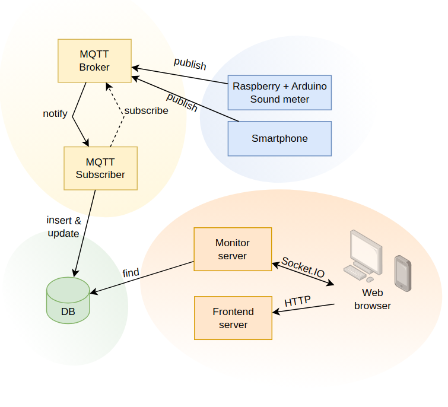
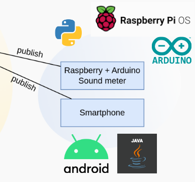
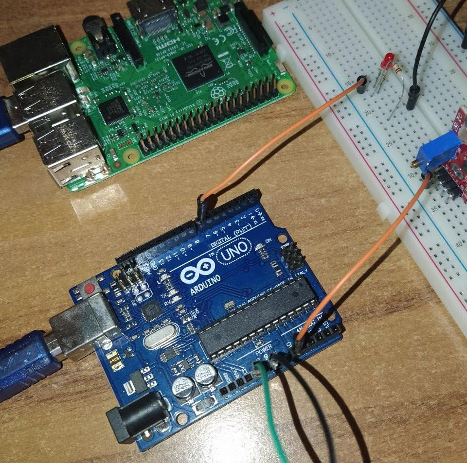
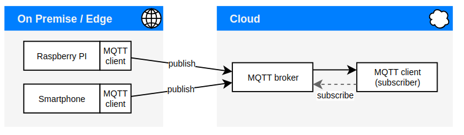
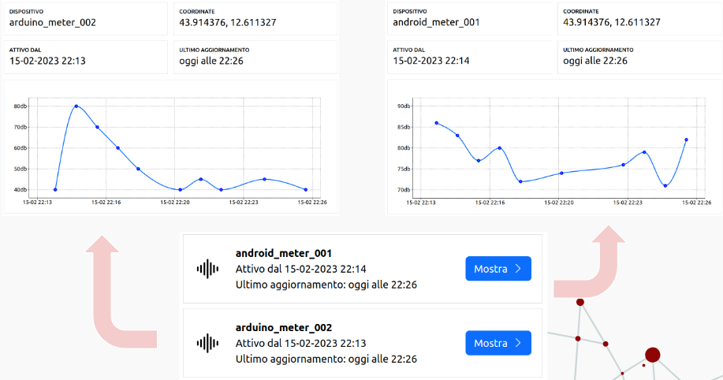

# Sound Pollution Monitoring IoT Platform
This is an IoT platform for monitoring and analyzing sound pollution levels in real-time. The platform includes a set of sensors that can be deployed in various locations to collect sound data, which is then processed and analyzed and made accessible to provide insights into noise pollution levels.

*This project was intially intended as a Master degree course mandatory project. I decided to independently expand the solution to allow real-time usage of retrieved data and not only back-end related activities*

## Features
- Real-time monitoring of sound pollution levels
- Data visualization and analysis of sound data
- Data storicization by means of a MongoDB server
- Scalable data acquisition
- Prototypal IoT devices
- Prototypal Andoird application 
- Scalable NodeJS Servers
- Socket based communications for efficient data monitoring

## Project Structure
The root folder contains code divided into subfolders for each of the main components of the solution:
- *database_mongodb* contains some python scripts for testing the most important queries;
- *meter_arduino* contains code to handle the Arduino micro-controller board (IoT sound meter)
- *mqtt_broker* contains the script to easily start the MQTT architecture broker on a local machine
- *mqtt_publisher_android* is a basic Android project to register and send sound level data to the MQTT platform
-  *mqtt_publisher_raspberry* contains python code for the RaspberryPI platform and is required to connect the meter_arduino subproject to the MQTT platform
-  *mqtt_subscriber* is a python project of a MQTT subscriber service which retrieves the data generated and sends it to the MongoDB  server
- *server_frontend* is a basic NodeJS frontend server provider, the frontend is developed in React
- *server_monitor* is another NodeJS server used to remotely monitor data changes with high efficiency and scalability

The following image displays the main elements of the Sound Pollution platform architecture.

### Devices and meters

Two solutions are provided to enable sounds level measurement over time. 
**First solution** for noise measurement with Raspberry PI platform and Arduino:
- Analog sensor KY-038 [5] performs the measurement;
- Arduino manages the sensor and sends the data to Raspberry PI via serial channel;
- RaspberryPI receives the data at Arduino and communicates it to an MQTT platform

**Second solution** with Android smartphone:
- The device's microphone can be used to measure the noise level;
- The Foreground Service framework allows long-duration and background tasks to run;
- The application constantly retrieves data from the microphone and communicates it to an MQTT platform;

The following photo shows an implementation of the demo IoT device using Arduino and Raspberry PI.

### MQTT data transfer architecture

Simple overview of the MQTT-based data transfer between devices and IoT platform.

### Remote access and dashboard

Monitor server handles all monitoring requests that come in from users
- A device is monitored only once
- Efficiency in relation to connected users

Frontend server provides a web app to users 
- OS independence
- A two-way channel between browser and monitor server	
- Client requests monitoring
- Server communicates updates

